# Canvas Application :rocket:

### How to run this package

- Double click on index.html

### How it works :open_book:

In the javascript folder, there are various functionalities for the canvas application (please implement more, here)

- javascript
  - mouseMethods.js
    - This class will be extended by all functionalities - it essentially tracks your variables as well as mouse events
  - lineFunction.js
    - State what happens when your user clicks on the mouse, moves the mouse, drags the mouse...
  - rectFunction.js
    - State what happens when your user clicks on the mouse, moves the mouse, drags the mouse...
- css
  - style.css

## Sprint :athletic_shoe:

| Done? | Component                               | Priority | Estimated Time | Actual Time |
| ----- | --------------------------------------- | :------: | :------------: | :---------: |
|       | Create repository                       |          |   5 minutes    |             |
|       | Make pull branch mandatory              |          |   5 minutes    |             |
|       | Practice pulling and pushing with group |          |   5 minutes    |             |
|       | Read Documentation                      |    M     |                |             |
|       | Write down a list of requirements       |    M     |                |             |
|       | Divide up the work                      |    M     |                |             |
|       | Look over the code                      |    M     |                |             |

| B | Style

| I | Ads (freemium, premium)  
| B | Canvas Common (DONE)  
| B | Clear
| B | Crop
| Z | Colour (DONE)
| I | Drawing Arc (add moving point, change colorStroke)
| B | Drawing Brush (DONE)
| Z | Drawing Circle (change colorFill, colorStroke)
| I | Drawing Curve
| B | Drawing Line (DONE)  
| Z | Drawing Polygon  
| I | Drawing Rectangle (change colorFill, colorStroke))  
| B | Eraser (DONE, add layers & use alternative way to erase)
| Z | Export / Download
| I | Fill  
| B | Filter  
| Z | Mouse  
| I | Select / Drag / Resize
| B | Text
| Z | Toolbar  
| I | Undo / Redo  
| B | Zoom

- [Further Documentation and Tutorial](https://developer.mozilla.org/en-US/docs/Web/API/Canvas_API/Tutorial/Basic_usage)

## Issues and Resolutions :flashlight:

**ERROR**: :gear:
**RESOLUTION**: :key:

| Issue                | Where it occurs | Possible solution | Actual solution |
| -------------------- | :-------------: | :---------------: | :-------------: |
| Creating a checklist |        H        |       2hrs        |     2.5hrs      |

#### What is one thing that I learned from doing this project? :books:

# GROUP 1 CANVAS

This is a HTML canvas containing multiple functions using JavaScript

## Get Started

First, select your color and stroke size with the selection tool shown as below

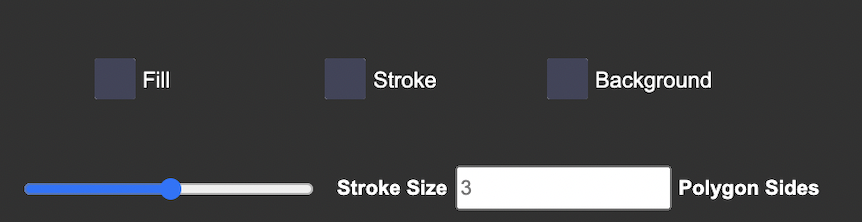

Fill: adjust the color inside your shapes  
Stroke: adjust the color of the stroke or border of your shapes  
Background: adjust the background of the entire canvas  

Stroke Size: adjust the width of your stroke or border of your shapes
Polygon Sides: adjust the sides of your polygon, e.g. 3 = triangle

## Select your function

After you have selected your color size,  
You can decide what you want to draw on the canvas.

## Line Function

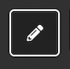  
Click on this box to select the line function  
Click on the canvas to register the starting position of the line  
Then drag your cursor to form a straight line.  
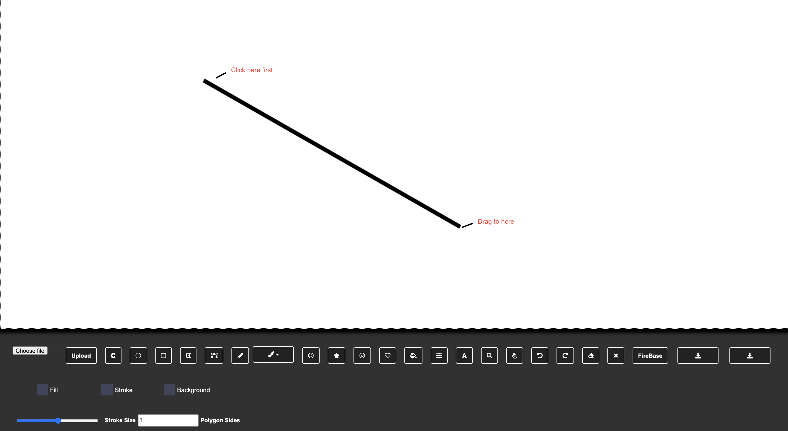  

## Curve Function  

#### Quadratic curve  
Quadratuc curve only have one control point  

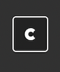  
Click on this box to select the arc function  
Click on the canvas to register the starting position of the arc  
Click on a second location to register the ending position of the arc   
Click on the canvas for the second time to set the contorl point of the arc  
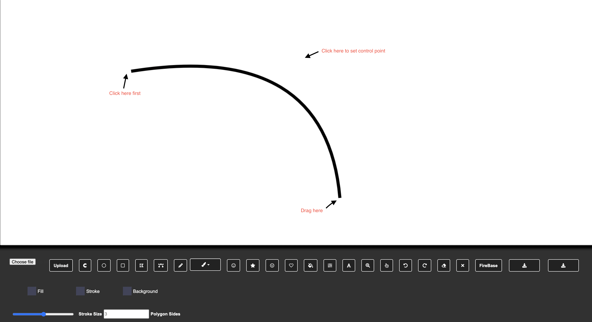  

#### Bezier curve  
Bezier curve has two control point  

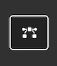  
Click on this box to select the bezier curve function  
Click on the canvas to register the starting position of the curve  
Click on a second location to register the ending position of the curve  
Click on a third location to register the first control point  
Click on a forth location to register the second control point  
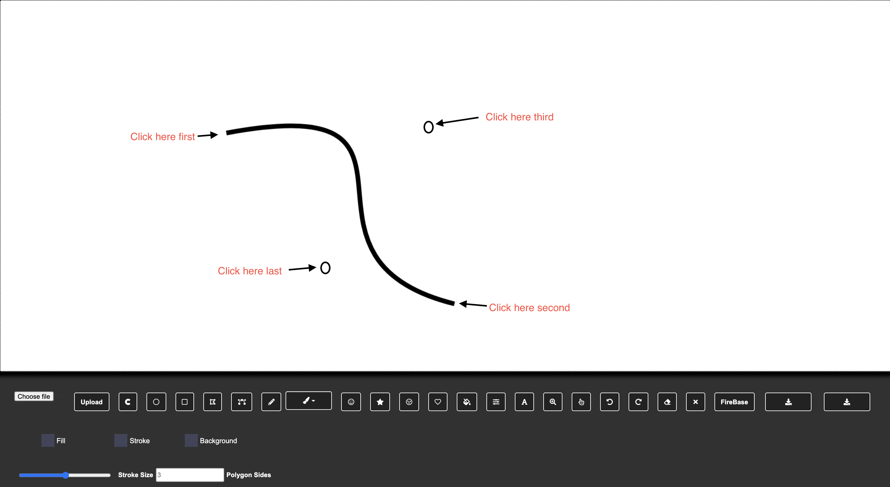  

## Draw Rectangel  

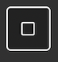  
Click on this box to select the rectangel function  
Click on the canvas to register the starting position of the rectangel  
Drag the cursor to form a rectangel  
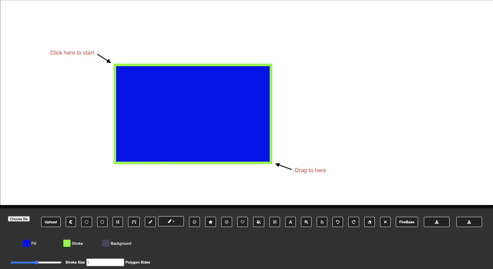

## Draw Circle  

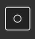  
Click on this box to select the circle function  
Click on the canvas to register the strating position of the circle  
Drage the Cursor to form a circle  
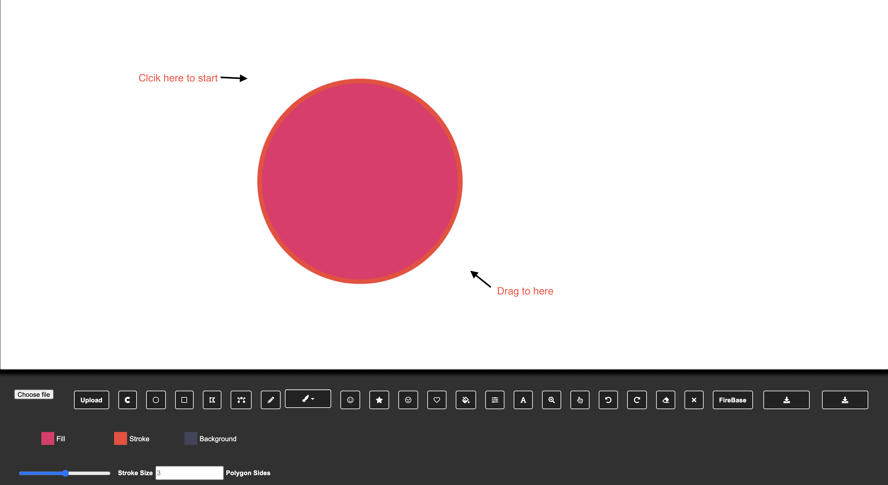  

## Brush  

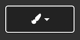  
Click on this box to select the brush function  
Paint the canvas with the desired brush effect  

## Stamp  

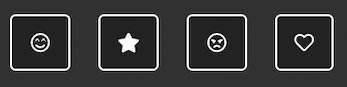  
Click on these boxes to select stamps  
Click on the canvas to stamp your selected emoji  

## Paint Bucket  

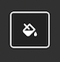  
Click on this box to select the paint bucket function  
Change the fill color  
Click on any spaces or line to fill it with the selected color  
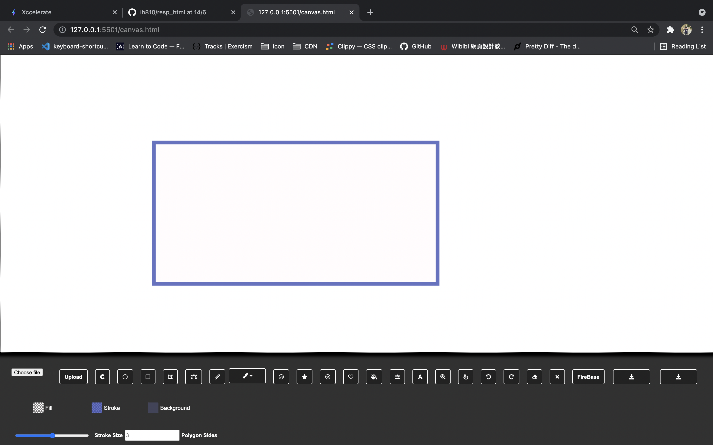  
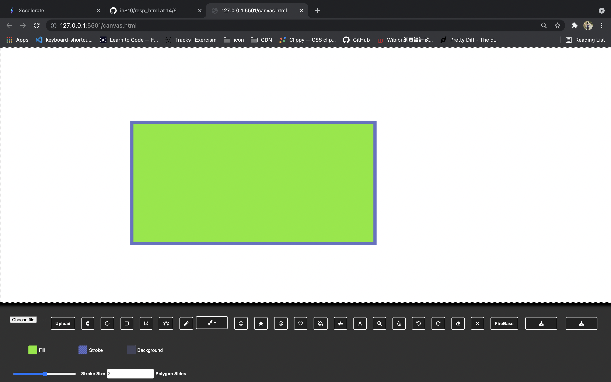  

## Filter  

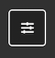  
Click on this box to apply a blur filter to the canvas  
You cannot undo this effect except reloading the page  
This filter basically give you a taste of being nearsighted  
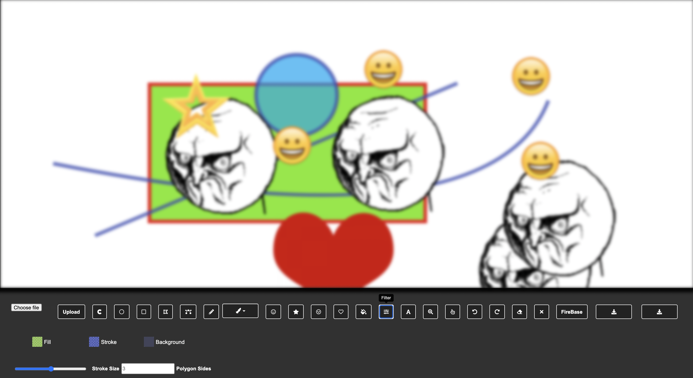

## Undo/Redo/Clear/Eraser  

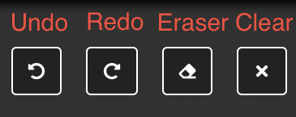  
Click on these boxes to manage your image  
Undo: undo your last stroke  
Redo: redo your last undo  
Eraser: erase the stroke in the selected area  
Clear: clear the entire canvas  

## Export Your Masterpiece

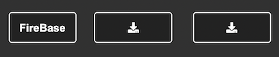  
Click on these boxes to export your canvas
